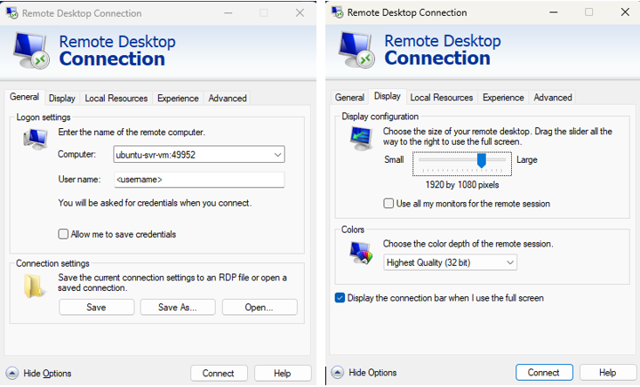
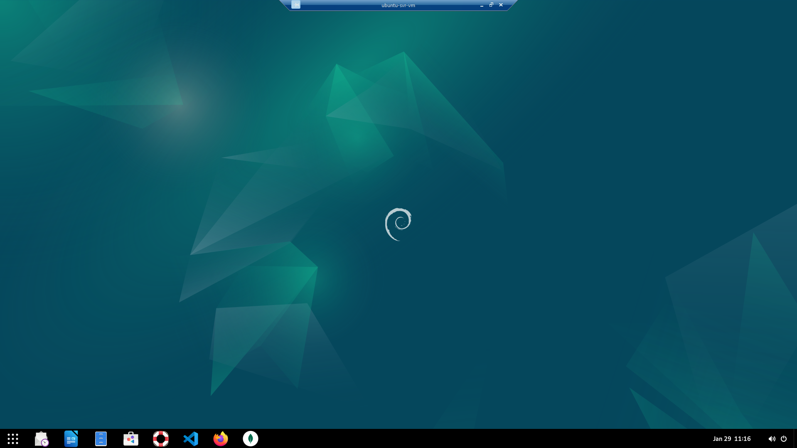

# Knowely.com knowely_full_stack

This overview isn't a comprehensive guide to setting up and configuring an Ubuntu VM on a Windows 11 PC. Instead, it details how I mimicked my company's work environment while taking training courses from [Coursera](https://www.coursera.org/), [Knowely](https://app.knowely.com/), [Pluralsight](https://www.pluralsight.com), and [Udemy](https://www.udemy.com/).

This was created to track and keep coursework divided, as an after thought, there could have been a tree structure in app/ and tests/ i.e. app/coursera/assignment_01 and tests/coursera/test_assignment_01 but doing without planning causes wishing :)

## Build a Ubuntu 22.04 vm on Windows

Hyper-V Manager on Windows 11

- [How to Install Ubuntu 24.04 or 22.04 Linux on Windows with Hyper-V](https://linux.how2shout.com/how-to-install-ubuntu-22-04-linux-on-windows-with-hyper-v/)
- [How to Connect to an Ubuntu Server via SSH from Windows: A Step-by-Step Guide](https://xemiron.com/how-to-connect-to-an-ubuntu-server-via-ssh-from-windows-a-step-by-step-guide/)

- Access to the Virtual Machines can be via the Hyper-V Connect screens or via MSTSC/RDP (Microsoft Terminal Services Client / Remote Desktop Connection).

    [How to RDP into the Ubuntu VM](https://phoenixnap.com/kb/ubuntu-remote-desktop-from-windows)
    Instructions show an IP address, but an RDP, as shown below, can occur if the hostname is configured on the Ubuntu VM.

    

    

Also installed on the Ubuntu VM...

- [Docker](https://get.docker.com)
    > The following script is not recommended for production environments:
    >> curl -fsSL [https://get.docker.com](https://get.docker.com) -o get-docker.sh sudo sh get-docker.sh
- [git](https://git-scm.com/downloads/linux)
    > sudo apt-get install git
- [Gnome](https://www.wikihow.com/Install-Gnome-on-Ubuntu)
    > sudo apt install ubuntu-gnome-desktop
- [MongoDB Community Server](https://www.mongodb.com/try/download/community)
- [Mongoose Compass](https://www.mongodb.com/try/download/compass)
- [DBeaver Community](https://dbeaver.io/download/)
- [OneDrive](https://ubuntuhandbook.org/index.php/2024/02/install-onedrive-ubuntu/)
    > sudo apt install onedrive
- [Postman](https://bytexd.com/how-to-install-postman-on-ubuntu/)
- [PowerShell](https://learn.microsoft.com/en-us/powershell/scripting/install/install-ubuntu?view=powershell-7.4)

## Environment used during the coding and testing phases

Windows 11 with an SSH connection to Ubuntu 24.04 vm

VS Code
pyenv
Python 3.10.16

Basic Steps for [How to install Pyenv in Ubuntu 22.04](https://itslinuxfoss.com/install-use-pyenv-ubuntu/)

    Step 1: Update the Ubuntu Repository
        $ sudo apt update

    Step 2: Download the Script of Pyenv in Ubuntu
        $ curl https://pyenv.run | bash

            If any dependencies error occurs, such as curl or git, then you can use the following commands to get rid of them:
                $ sudo apt install curl -y
                $ sudo apt install git -y
    
    Step 3: Add the Environment Variables Into bashrc File
        $ export PATH="$HOME/.pyenv/bin:$PATH" && eval "$(pyenv init --path)" && echo -e 'if command -v pyenv 1>/dev/null 2>&1; then\n eval "$(pyenv init -)"\nfi' >> ~/.bashrc
    
    Step 4: Restart the Shell in Ubuntu
        $ exec $SHELL

    Step 5: Display the Installed Version of the Pyenv in Ubuntu
        $ pyenv --version
    
    Step 6: Install Python Version 3.10.16
        $ pyenv install 3.10.16

    Step 7: Validate Successful installation
        $ pyenv versions
    
    Step 8: Set pyenv python version
        $ pyenv global 3.10.16
        $ pyenv local 3.10.16   - This will generate/replace the .python-version file if done within VS Code

## Other installs and miscellaneous items

### Markdown Cheat Sheet

[MarkdownCanDo](https://www.markdowncando.com/reference/cheatsheet/)

For better image clarity in Markdown files, image formatting is as follows:  
```html
" alt="<Alt Text>" style="width:900px;height:auto;">
```

### Install Anaconda (if necessary/desired)

[Anaconda](https://www.anaconda.com)

## Commands used during coding and testing

[This Repository on GitHub](https://github.com/mcspidy/knowely_python_core)

To utilize this repository, fork a copy to your [GitHub.com](https://GitHub.com) account

### Defaults

[requirements.txt](https://github.com/mcspidy/knowely_python_core/blob/main/requirements.txt) contains black, flake8, matplotlib, numpy, pandas, pep8, and pytest (my common development packages)

    git branch                      - displays all branches

    git checkout -b <new branch>    - adds new branch

don't forget to commit and sync to save

    git checkout main           - returns to default state

### Create a Link in your working directory for faster access

Faster way to get to the project (Ubuntu)

    cd <project library>
    ln -s ~/<Local Clone Parent Folder>/knowely_python_core knowely_python_core

### Set a virtual environment

    python -m venv <virtual environment>
    source <virtual environment>/bin/activate   - to activate the virtual

    deactivate                                  - to deactivate the virtual

    * If space is a concern; delete the <virtual environment> location

    Other virtual environment

    pipenv shell

### Module not Found

    Issue

    - Python can't find my module
    - Python can't find module in the same folder

    Solution 

    - Replacing the current PYTHONPATH with the local library

        export PYTHONPATH=$(pwd)
    
        or 

    - Adding the local library to the current PYTHONPATH
    
        export PYTHONPATH=$PYTHONPATH:$(pwd)

### Install packages

    python -m pip install --upgrade pip
    python -m pip install -r requirements.txt

### Install the formatting tools into the virtual

    python -m pip install flake8
    python -m pip install black

    * All are in the requirements.txt file

### One Line Command for testing setup

    python -m venv venv && source venv/bin/activate && python -m pip install --upgrade pip && python -m pip install -r requirements.txt && export PYTHONPATH=$(pwd)

## Always refer to the MAIN branch

    Newer README.md documentation will only be updated on the main branch, sub-branches will not be pulled.

## Free videos

>
>[Tutorials and walkthroughs for software developers, programmers, and engineer by Corey Schafer](https://www.youtube.com/@coreyms)
>
